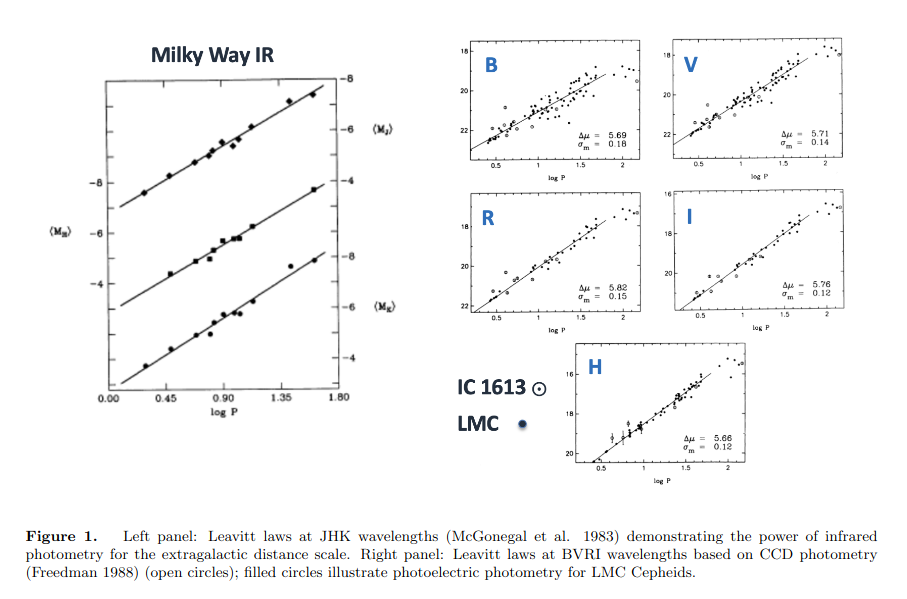
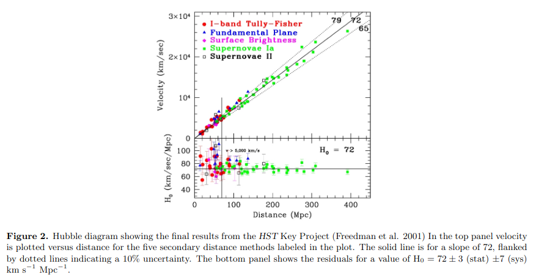
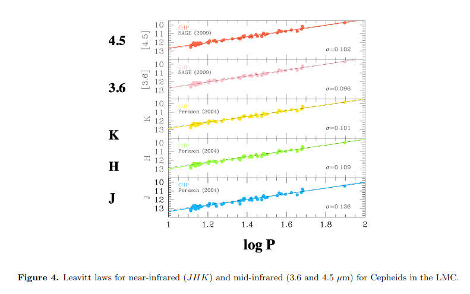
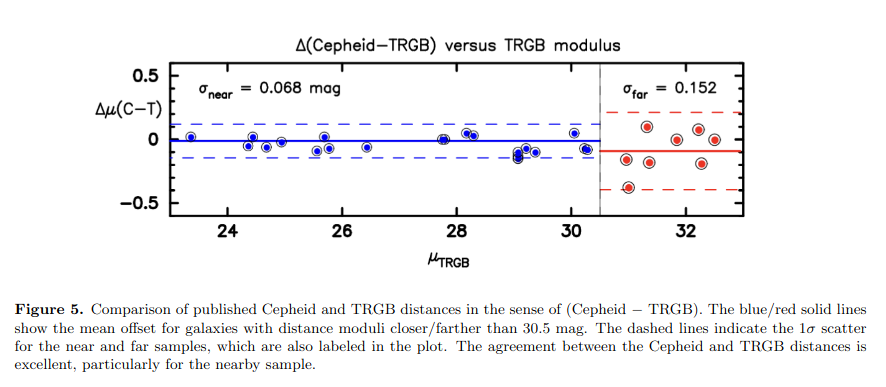
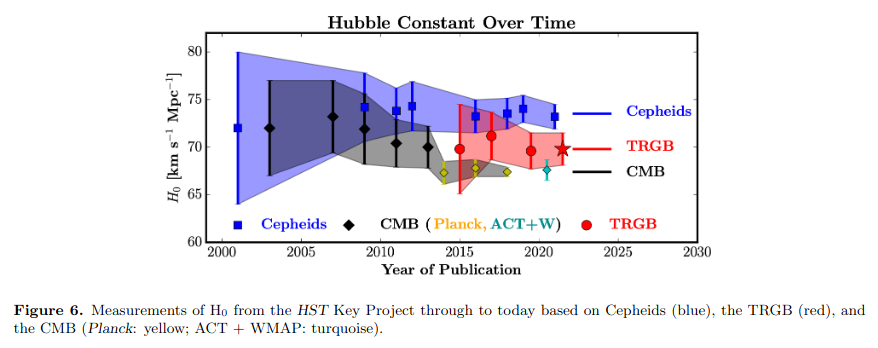

# Cepheids

## Introduction

Notes based on the excellent review of conference proceedings by Wendy Freedman and Barry Madore: Cepheids: Past, Present and Future (https://arxiv.org/pdf/2308.02474.pdf)

## Henrietta Leavitt
<iframe width="560" height="315" src="https://www.youtube.com/embed/2FrY6gRPC7k" title="YouTube video player" frameborder="0" allow="accelerometer; autoplay; clipboard-write; encrypted-media; gyroscope; picture-in-picture; web-share" allowfullscreen></iframe>

>Story Time: She worked at the Harvard College Observatory as a "computer" (a person who computes) and was paid 30 cents an hour. She was also a suffragette (_a woman seeking the right to vote through organized protest, a term originating in Britain to mock women fighting for the right to vote_) and was arrested for picketing the White House in 1917. She died of cancer in 1921. Hubble mentioned that she should have won the Nobel Prize, but Nobel Prizes are and were not awarded posthumously. Before Leavitt the only way to measure distances was using parallax. This only works for nearby stars. If a star was dim, there was no other way to tell if it was just dim or actually further away
1

### Timeline of Cepheid Developments

- **1908**: Leavitt Law, 25 Cepheids
- **1923-26**: Hubble Law, M31, M33 and NGC 6822
- **1950s**: Cepheids in the Milky Way clusters, 
- **1960s**: Wisniewski & Johnson's photoelectric $UBVRIJKL$ (_astronomers and their alphabets!_) photometry of Milky Way Cepheids:
    1. Decrease in amplitude from UV to IR
    1. Shift in relative phase of maximum light, from UV to IR
- **1970-90s**: $H_0$ "factor-of-two" debate: 50 or 100 km/s/Mpc
- **2001**: HST Key Project: $H_0$ = 72 $\pm$ 10% km/s/Mpc, Freedman et al. 2001

Cepheid measurements are still non-trivial:
- Crowding and confusion. 
- Presence of dust, which can scatter/absorb radiation. Cepheids are often found in dusty regions because they are young stars and haven't had time to clear out the dust in their neighborhood.
- Metallicity: may affect the luminosity

## Cepheid Milestones

### IR is good:

Decrease in width is primarily due to decrease in sensitivity of the infrared surface brightness to the intrinsic temperature width of the instability strip. 

>The instability strip is the region in the HR diagram where stars are unstable. The width of the instability strip is the range of temperatures where stars are unstable. The surface brightness is the brightness of the star as seen from Earth. The intrinsic temperature width is the range of temperatures that the star has. The sensitivity of the infrared surface brightness is how much the brightness of the star changes as the temperature changes.

### CCDs are good:

Local sky subtraction is easy, point spread function fitting can be done. Easier to handle crowding and confusion. Large wavelength coverage. Allowed the first and direct determination of reddening.

>Reddening: Dust in the Milky Way can absorb and scatter light. This is a problem for Cepheids because they are often found in dusty regions. The reddening is wavelength dependent and is also a function of distance. 

## Hubble Space Telescope Key Project

Hubble Key Project: Cepheids from 18 galaxies = 72 $\pm$ 3(stat) $\pm$ 7(sys) km/s/Mpc, resolves the factor-of-two debate.

Allowed calibration of secondary distance indicators: SNe Ia, Tully-Fisher, Fundamental Plane, Surface Brightness Fluctuations, $D_n-\sigma$, etc.

>Secondary distance indicators: These are distance indicators that are calibrated using Cepheids. They are called secondary because they are calibrated using Cepheids, which are primary distance indicators.

## HST/NICMOS

NICMOS: Near Infrared Camera and Multi-Object Spectrometer 
- established that reddening law is the same in the Milky Way and in other galaxies.
- metallicity effects are dependent on inner (high surface brightness) and outer disk populations in a galaxy. Advantages of using IR to mitigate extinction were countered by systematic effects of crowding and blending.

>NICMOS is a camera on the Hubble Space Telescope that can take pictures in the near infrared. It was installed in 1997 and was used until 2008. It was replaced by WFC3, the Wide Field Camera 3. HST is a warm telescope. The IR background flux collected by cooled focal plane IR instruments like NICMOS or WFC3 is dominated, at rather short wavelengths, by telescope thermal emission rather than by zodiacal scattering. NICMOS data show that the telescope background exceeds the zodiacal background at wavelengths longer than $λ \approx 1.6 \ \mu\text{m}$, the exact value depending on the pointing on the sky and on the position of the Earth on its orbit. Despite this, the combination of Hubble's mirror and NICMOS offered never-before seen levels of quality in near-infrared performance at that time.

Ground-Based Near-IR Observations:

Very small dispersion in Leavitt Law, Period-Luminosity-Color relation. So when crowding/blending is minimized, IR is still good.

## Spitzer Space Telescope

Spitzer Space Telescope: 3.6 and 4.5 $\mu$m bands are good. Allowed high-precision, reddening corrected distance to LMC, which allowed better calibration for HST Key Project = 74.3 $\pm$ 2.1(sys) km/s/Mpc in Freedman et al (2012).

Araucaria Project: For 20+ years, continues to carry out measurements of many variable stars in nearby galaxies. Improves fundamental distances to nearby galaxies and tests for metallicity effects.

## SH0ES Program

SH0ES: Supernovae, $H_0$ for the Equation of State of Dark Energy.

- Initially aimed at studying dark energy, now determines $H_0$ to 1% = $73.04 \pm 1.04$ km/s/Mpc. 
- Reddening corrections obtained using a small (2 to 4) number of random phase observations in two bands. Distances coming from ~11 observations in one band.
- Scatter in P-L relation is of order 0.4-0.5 mag, ~4x larger than uncrowded Cepheids in LMC.
- Zero-point calibration is set by geometric Gaia Early Data Release 3 , masers in NGC 4258 and detached eclipsing binaries in LMC.
- Uses ~42 galaxies with distances from 7-80 Mpc.

## TRGB: An independent external check of Cepheid distances

TRGB: Tip of the Red Giant Branch
>The Hertzsprung–Russell diagram (HR diagram) is a plot of stellar luminosity versus surface temperature for a population of stars. During the core hydrogen burning phase of a Sun-like star's lifetime, it will appear on the HR diagram at a position along a diagonal band called the main sequence. When the hydrogen at the core is exhausted, energy will continue to be generated by hydrogen fusion in a shell around the core. The center of the star will accumulate the helium "ash" from this fusion and the star will migrate along an evolutionary branch of the HR diagram that leads toward the upper right. That is, the surface temperature will decrease and the total energy output (luminosity) of the star will increase as the surface area increases.
At a certain point, the helium at the core of the star will reach a pressure and temperature where it can begin to undergo nuclear fusion through the triple-alpha process. For a star with less than 1.8 times the mass of the Sun, this will occur in a process called the helium flash. The evolutionary track of the star will then carry it toward the left of the HR diagram as the surface temperature increases under the new equilibrium. The result is a sharp discontinuity in the evolutionary track of the star on the HR diagram. This discontinuity is called the tip of the red-giant branch. 

- Few methods rival Cepheids, this one is good.
- Can be applied to halos of galaxies where dust is negligible, surface brightness is 100x lower so crowding/blending is not an issue.
- Easier issue to measure luminosity of halo TRGB star than disentangle Cepheids from neighboring stars in the disk.
- Metallicity effects are much smaller than for Cepheids, and can be directly calibrated.

