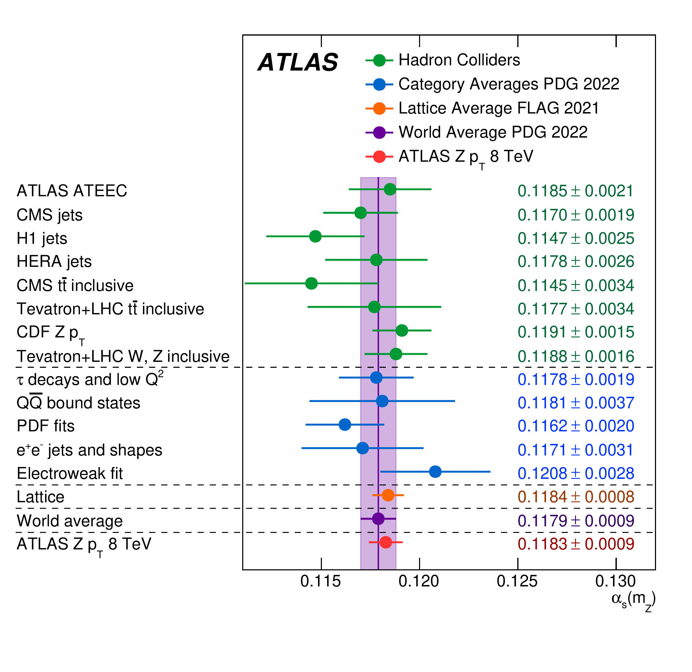
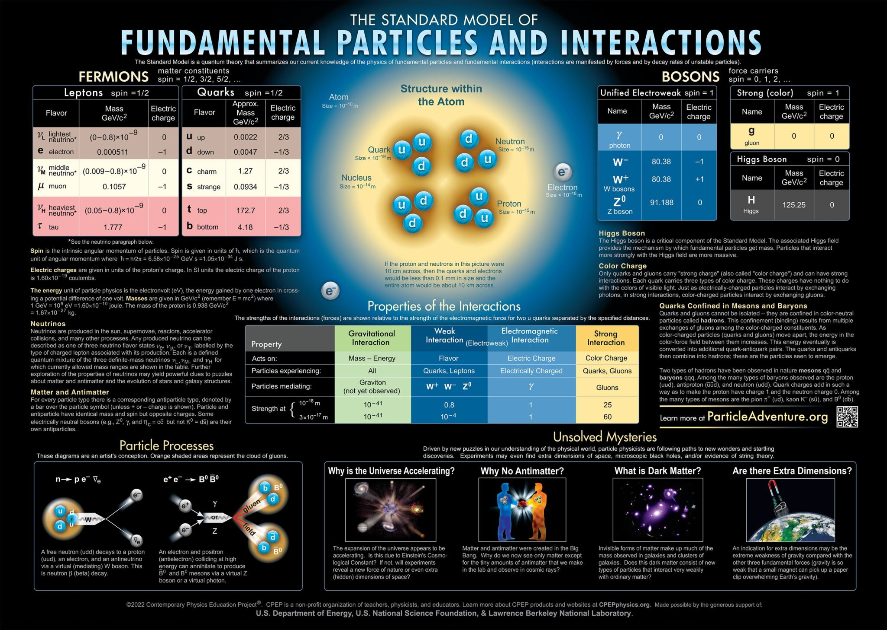
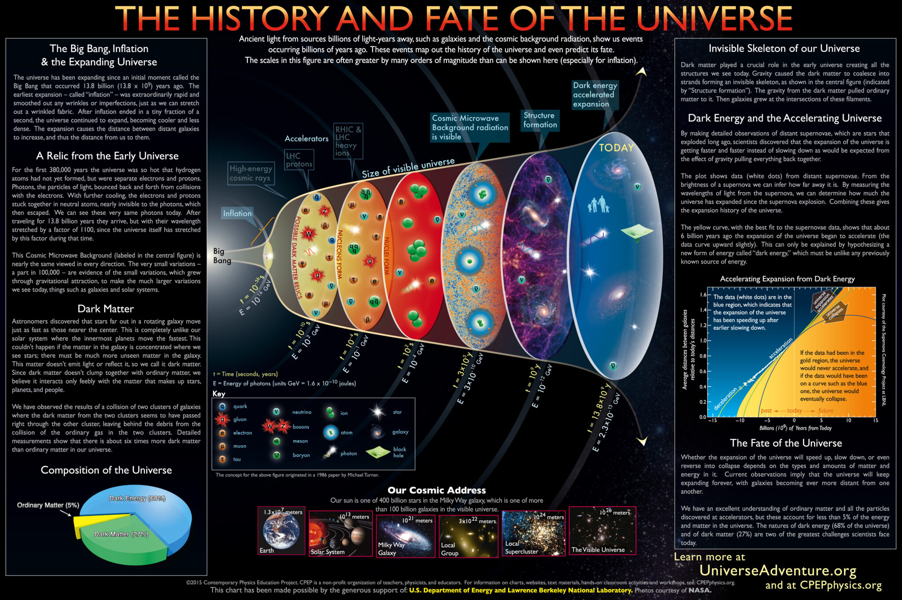
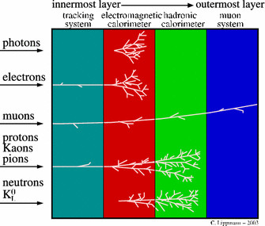

# Particle Physics - A Brief Overview

## Overview

Griffiths Elementary Particles:
1. Quark Model pp35-47
1. Confinement pp41-44
1. Quark Masses, Science Magazine https://www.science.org/content/article/mass-common-quark-finally-nailed-down
1. QCD pp66-71

## What We Know

**Particle Classification by Spin:**

"Intrinsic Angular Momentum". Charged leptons have magnetic moments are characteristic of point-like particles, hadrons have very different magnetic moments. The magnetic moment of a particle is proportional to its spin. 

**Vacuum is not empty:**

QFT vacuum feature. Higgs has a vev.

**Isospin: Another classificaton property**

Leptons consist of three families with individual conserved numbers $L_e, L_\mu, L_\tau$ that satisfies 
$$Q- I_3 = - \frac{1}{2}L$$

This weak charge of leptons is corrrelated with $I_3$. 

### Strong Coupling

Obtained via transverse momentum of the $Z$ boson, and comparison with theory.

A website with cool single slides of various fields:

https://www.cpepphysics.org/

> Antimatter has the same gravitational properties as matter. Read more about the Alpha-G experiment. https://www.nature.com/articles/s41586-023-06527-1

### How to understand particle detectors as  a theorist

### Nobel Prize in Physics 2023

https://www.nobelprize.org/prizes/physics/2023/summary/

> 1. Nov 6: Short 3 page progress report
> 1. Nov 20: Oral Presentation 1 slide/5min (Slide by Nov 17)
> 1. Dec 13: Final Submission 10 pages

