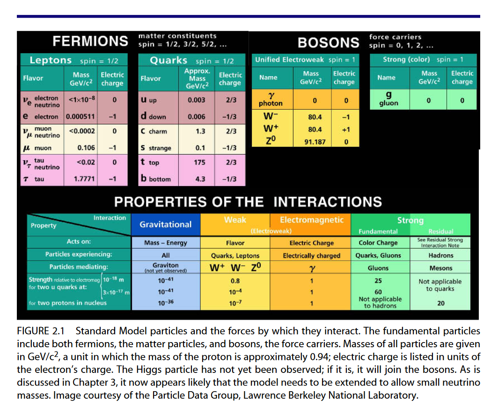

# Frontiers in Astrophysics

## Course Information

Check prev course at UC Riverside. **insert link** Mostly an experimental viewpoint. Background theory will be HW

- Attendance is mandatory
- ~10 page paper on 'Forefront topic'. Not the topic of thesis.
- No final, one on one meeting with prof ~30 minutes

#### Neutrino Observatories

JUNO: _ Underground Neutrino Observatory. 

- mass ordering. natural to think the same as leptons $e,\mu,\tau$, but is not necessarily. Normal heirarchy preffered oer inverted, 2 sigma. Soon, 3 sigma. Within 10-15 years , we will know - Chang Kee
- Two big experiments coming up: Fermilab. Japan.

> Fun fact: Barry thought he would be a tennis player, or a novelist as a kid. Then he has moved around physics a lot too. Point is, it is not hard to move around in physics.

> International Linear Collider? 

> Look up Barry's lecture from last year at SBU

#### Particle Physics 2000s

- APS - Particles and Fields. 2000, study of the future of particle physics. Barish and John Bagger. First figure is now the definitioin of particle physics.
- Connecting Quarks with Cosmos, 2003. pose "eleven questions for the new century"

## Week 1 & 2: Connecting Quarks to the Cosmos: 11 Questions

Link: 
https://www.fnal.gov/pub/max/pdfs/Connecting%20Quarks%20with%20the%20Cosmos.pdf

Local Link: 

### Chapter 1: Where we are and where we can be?

>Principia: best book on science ever written. -Barry.
>Primarily helped Newton predict Halley's comet.

- Standard Model for Particle Physics: 3 generations of quarks and leptons. 4 forces. Higgs boson.
- Cosmology: Big Bang, Inflation, Dark Matter, Dark Energy

### Chapter 2: Matter, Space, and Time

- Twin Revolutions: Quantum Mechanics and Relativity
- Why particle dominated universe? Why not anti-particle? Look up Sakharov conditions. https://en.wikipedia.org/wiki/Baryogenesis

>#### Neutrino CP-violation
>
>Notes from https://neutrinos.fnal.gov/mysteries/cp-violation/.
>In physics everything is invariant under CPT. CPT Theorem! Thus, for every process there is a mirror process with an antiparticle. If CP violated, then we can create more matter than antimatter. This is baryogenesis.

>Almost everyone believes proton has to be unstable. -Barry 

- note missing higgs. soonTM.
- why three gens
- quark masses are very different

Discovery of top quark:
first where reqd the right ideas from theorists. reqd good instrumentation - silicon trackers.  